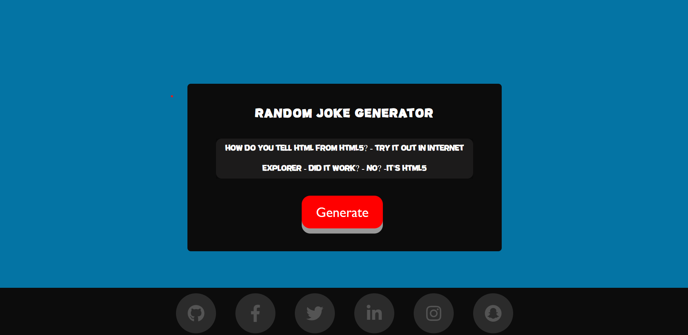

<h1 align="center">Joke Generator</h1>

This is a web application that generates random jokes based on different categories. The app is built using HTML, CSS, JavaScript and the jokes are sourced from local storage.

## 🖥️ Tech Stack
**Frontend:**

&nbsp;
&nbsp;
&nbsp;

**Deployed On:**

## 📌 Key Features:
        <ul type="circle">
          <li>Generates random jokes based on categories such as puns, one-liners, and dad jokes.</li> 
          <li>Users can select their preferred category of jokes.</li> 
          <li>Simple and intuitive user interface.</li> 
        </ul>
## 📌 Screenshots:

