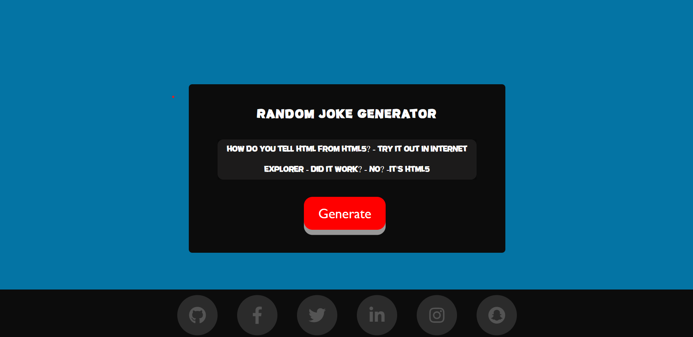

<h1 align="center">Joke Generator</h1>

This is a web application that generates random jokes based on different categories. The app is built using HTML, CSS, JavaScript and the jokes are sourced from local storage.

<h2>📌 Features: </h2>
        <ul type="circle">
          <li>Generates random jokes based on categories such as puns, one-liners, and dad jokes.</li> 
          <li>Users can select their preferred category of jokes.</li> 
          <li>Simple and intuitive user interface.</li> 
        </ul>
<h2>📌 Screenshots</h2>

